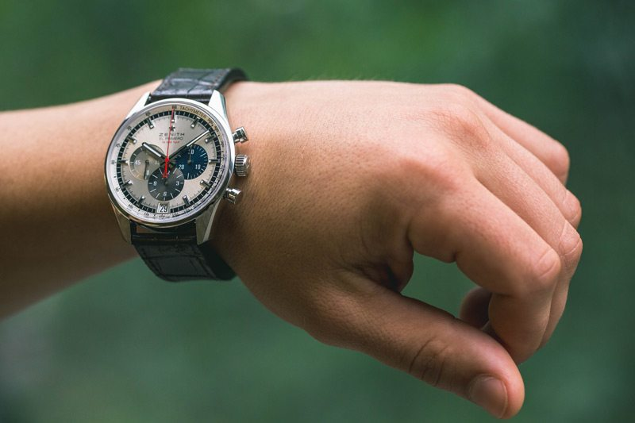
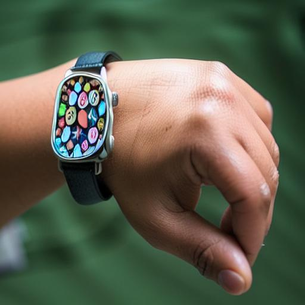
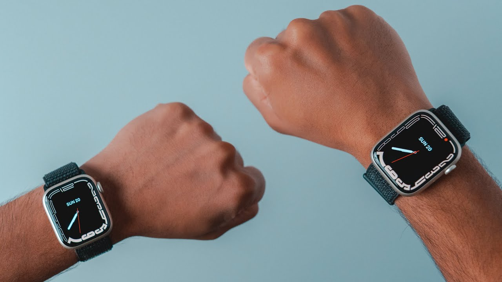
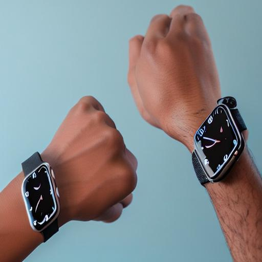
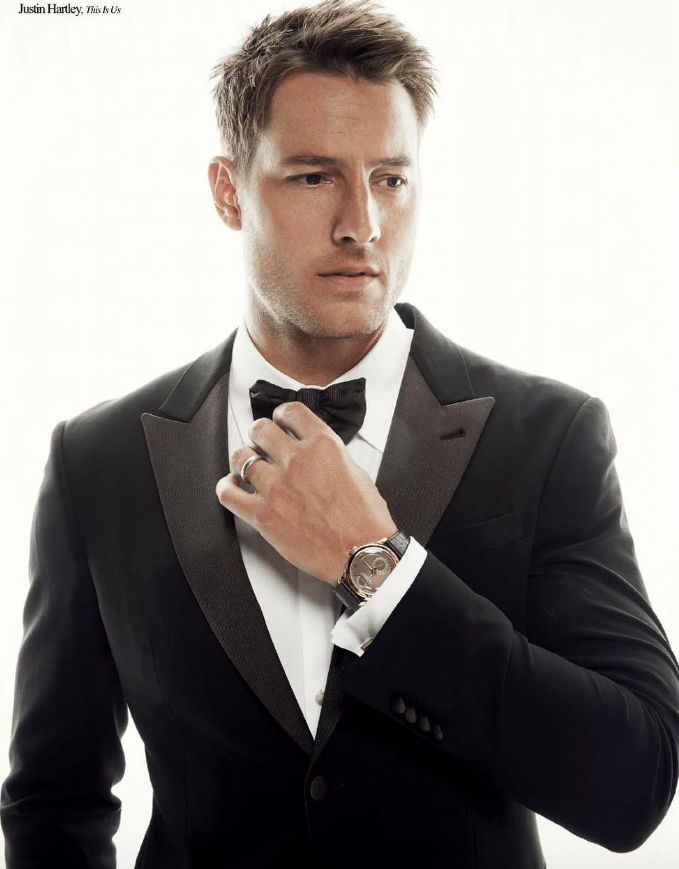
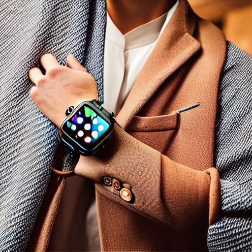
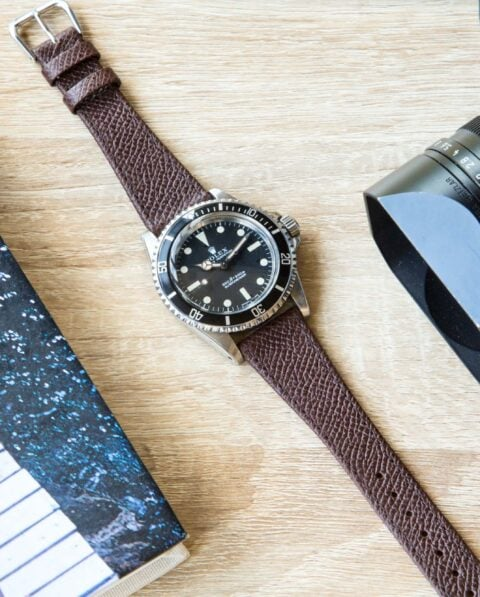
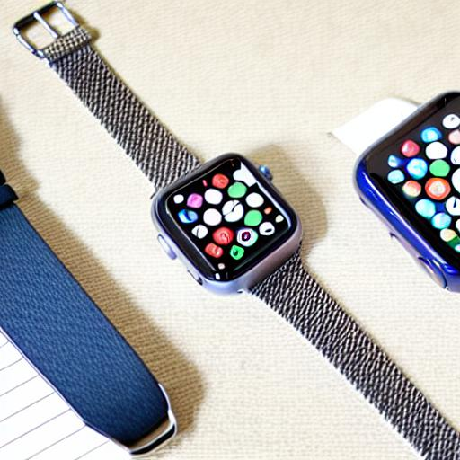
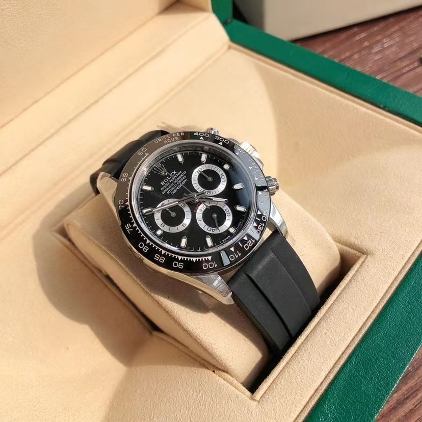
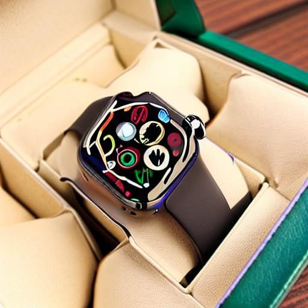

# Ads Generator

The gole of this project is to generate ads by given few number of images of a specific brand. In this project, instead of describing the ad scene in text (prompt), I use a sample image for simplisity. Sometimes we are not caple of defining every details of the scene that we are going to create. The model uses the sample given image and recreate the scene with the a brand item.

I have used [DreamBooth](https://github.com/google/dreambooth) to train a StableDiffusion model with few number of samples of the specific item that I have. Here my samples were Apple watch and DARA doll. Then the stable diffusion is capable to generate the items.

Given the sample scene image and prompting with just the brand item name like Aplle watch or DARA doll, I am caple to create new images with the theme of the given image.

Some samples are provided as below. In the left row the sample ad scene images are given. the generated image is demonstrated in the right colomn.

 
 
 
 
 
 
 
 
