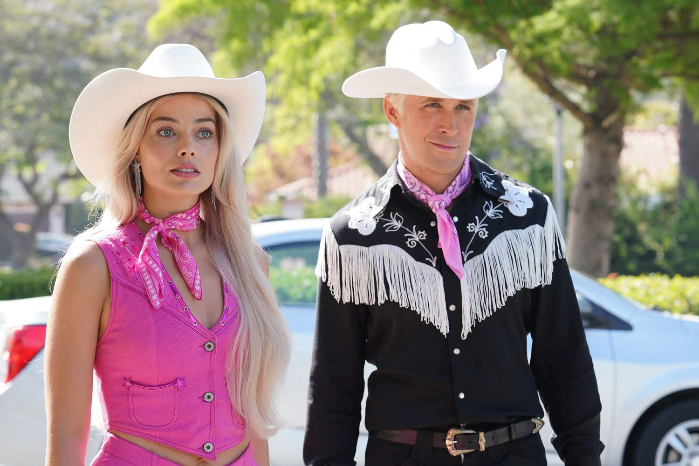
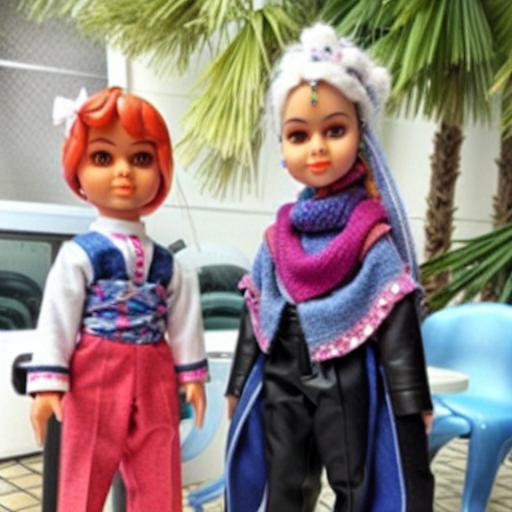
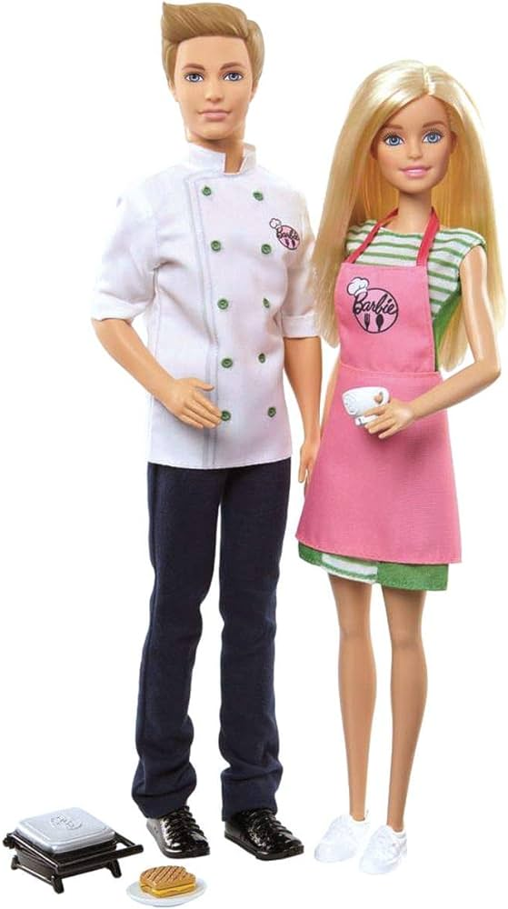
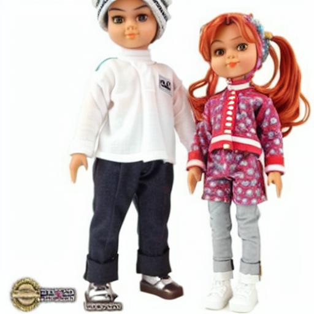
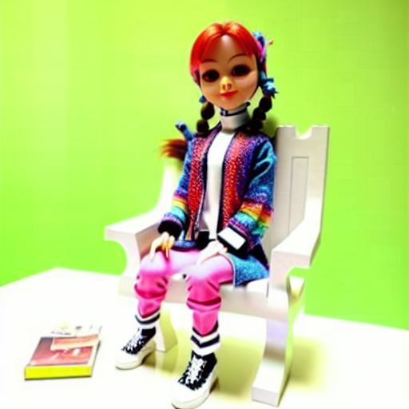
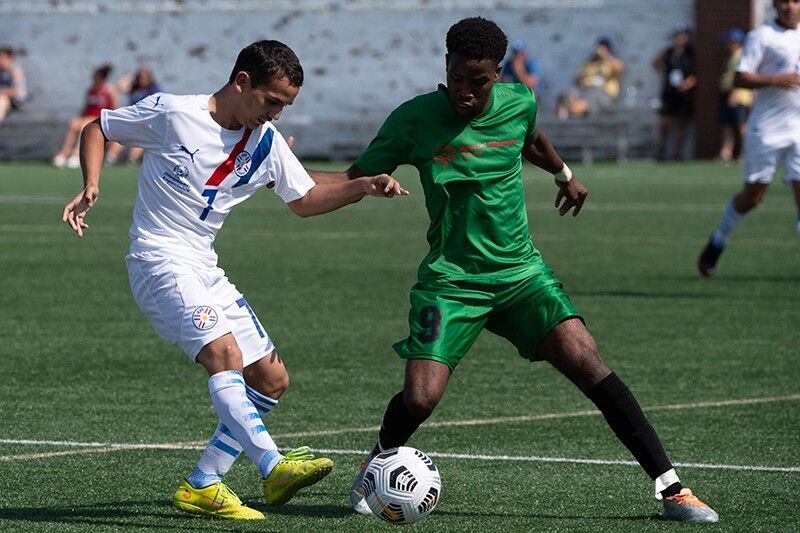

# Ad Generator

The goal of this project is to generate advertisement images about specific brand items using StableDiffusion model. 
Generative models like SD usually are general-purpose models and are not trained to reproduce specific brand items. Then the first challenge in this project is to fine-tune the model with a few samples that after fine-tuning it still can reproduce high-quality images of that brand in variant shapes. The next challenge is prompting. Sometimes to reach an acceptable result, we really should know how to ask the model by a good prompting.

To address the first challenge, I have used [DreamBooth](https://github.com/google/dreambooth) approach to retrain a StableDiffusion model with few samples of the specific item. Here my samples are DARA&SARA doll. The fine-tuned StableDiffusion model is capable of generating the items.

To address the second challenge, instead of describing the scene by the text (prompt), I use a sample scene image as a description. The model is supposed to use the sample given scene image and recreate the scene while adding the brand item into. This project is for those who find prompting a chore!

Given the sample scene image and prompting shortly like DARA&SARA doll, I am capable of creating new images with the theme of the given scene image.

Some samples are provided below. In the left column, the sample ad scene images are given. the generated images are demonstrated in the right column.

 
 
 
 

## How to run?
pip install -r requirements. txt

Go to the DreamBooth page download the code and follow the instructions to train the model with the desired item images and given prompt.

Copy the trained model folder to the root folder of the project.

Use the Config.yaml file to adjust the hyperparameters to reproduce the images in a way that you like.

All the parameters are defined in Config.yaml file like input and output images' addresses, denoising steps, prompt, similarity scale to the scene image and prompt.

Run main_.py

